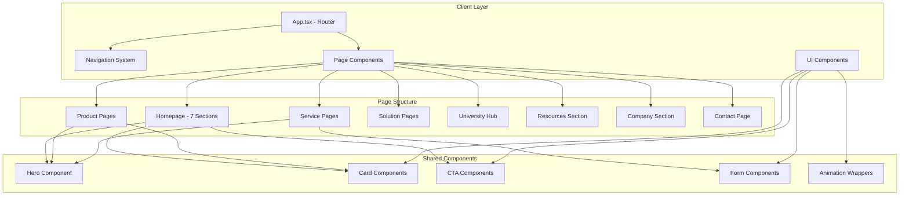
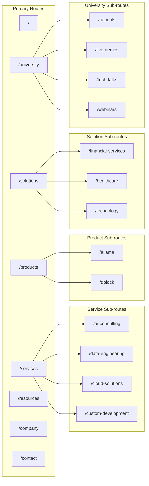

# Design Document: DigitransLab Website Redesign

## Overview

This design document outlines the technical architecture and implementation approach for the DigitransLab website redesign. The redesign transforms the existing React/TypeScript website into a comprehensive platform showcasing AI agentic automation services, products (Allama, DBLOCK), industry solutions, and educational content through the University learning hub.

The implementation leverages the existing technology stack (Vite, Tailwind CSS, Framer Motion, shadcn/ui) while introducing new page components, an enhanced navigation system, and a cohesive design system with glass morphism effects and purple/blue gradient accents.

## Architecture

### High-Level Architecture



### Routing Architecture



## Components and Interfaces

### Navigation Component

```typescript
// src/components/navigation/MainNav.tsx
interface NavItem {
  label: string;
  href: string;
  children?: NavItem[];
}

interface MainNavProps {
  items: NavItem[];
  currentPath: string;
}

// Navigation structure
const navigationItems: NavItem[] = [
  {
    label: "Services",
    href: "/services",
    children: [
      { label: "AI Consulting", href: "/services/ai-consulting" },
      { label: "Data Engineering", href: "/services/data-engineering" },
      { label: "Cloud Solutions", href: "/services/cloud-solutions" },
      { label: "Custom Development", href: "/services/custom-development" },
    ],
  },
  {
    label: "Products",
    href: "/products",
    children: [
      { label: "Allama", href: "/products/allama" },
      { label: "DBLOCK", href: "/products/dblock" },
    ],
  },
  {
    label: "Solutions",
    href: "/solutions",
    children: [
      { label: "Financial Services", href: "/solutions/financial-services" },
      { label: "Healthcare", href: "/solutions/healthcare" },
      { label: "Technology", href: "/solutions/technology" },
    ],
  },
  {
    label: "University",
    href: "/university",
    children: [
      { label: "Tutorials", href: "/university/tutorials" },
      { label: "Live Demos", href: "/university/live-demos" },
      { label: "Tech Talks", href: "/university/tech-talks" },
      { label: "Webinars", href: "/university/webinars" },
    ],
  },
  {
    label: "Resources",
    href: "/resources",
    children: [
      { label: "Blog", href: "/resources/blog" },
      { label: "Case Studies", href: "/resources/case-studies" },
      { label: "Documentation", href: "/resources/documentation" },
    ],
  },
  {
    label: "Company",
    href: "/company",
    children: [
      { label: "About", href: "/company/about" },
      { label: "Team", href: "/company/team" },
      { label: "Careers", href: "/company/careers" },
      { label: "Investors", href: "/company/investors" },
    ],
  },
  { label: "Contact", href: "/contact" },
];
```

### Homepage Section Components

```typescript
// src/components/sections/homepage/HeroSection.tsx
interface HeroSectionProps {
  headline: string;
  subheadline?: string;
  primaryCTA: CTAProps;
  secondaryCTA: CTAProps;
  trustBadges?: TrustBadge[];
  videoUrl?: string;
}

interface CTAProps {
  label: string;
  href: string;
  variant: "primary" | "secondary";
  onClick?: () => void;
}

interface TrustBadge {
  icon?: React.ReactNode;
  label: string;
  value?: string;
}

// src/components/sections/homepage/ThreePillarsSection.tsx
interface Pillar {
  icon: React.ReactNode;
  title: string;
  description: string;
  href: string;
  features: string[];
}

interface ThreePillarsSectionProps {
  pillars: Pillar[];
}

// src/components/sections/homepage/ProductsShowcaseSection.tsx
interface ProductCard {
  name: string;
  tagline: string;
  description: string;
  features: string[];
  href: string;
  status: "live" | "coming-soon";
  ctaLabel: string;
}

interface ProductsShowcaseSectionProps {
  products: ProductCard[];
}

// src/components/sections/homepage/IndustriesSection.tsx
interface Industry {
  icon: React.ReactNode;
  name: string;
  description: string;
  href: string;
}

interface IndustriesSectionProps {
  industries: Industry[];
}

// src/components/sections/homepage/WhyDigitransLabSection.tsx
interface Differentiator {
  icon: React.ReactNode;
  title: string;
  description: string;
  metric?: {
    value: string;
    label: string;
  };
}

interface WhyDigitransLabSectionProps {
  differentiators: Differentiator[];
}

// src/components/sections/homepage/TestimonialsSection.tsx
interface Testimonial {
  quote: string;
  author: string;
  title: string;
  company: string;
  avatar?: string;
}

interface TestimonialsSectionProps {
  testimonials: Testimonial[];
}

// src/components/sections/homepage/FinalCTASection.tsx
interface FinalCTASectionProps {
  headline: string;
  subheadline?: string;
  primaryCTA: CTAProps;
  secondaryCTA: CTAProps;
}
```

### Product Page Components

```typescript
// src/components/pages/products/AllamaPage.tsx
interface AllamaFeature {
  icon: React.ReactNode;
  title: string;
  description: string;
  capabilities: string[];
}

interface Integration {
  category: string;
  tools: string[];
}

interface CompetitorComparison {
  aspect: string;
  allama: string;
  competitor: string;
}

interface AllamaPageProps {
  hero: {
    tagline: string;
    headline: string;
    description: string;
    primaryCTA: CTAProps;
    secondaryCTA: CTAProps;
  };
  valuePropositions: {
    title: string;
    description: string;
    icon: React.ReactNode;
  }[];
  features: AllamaFeature[];
  integrations: Integration[];
  deploymentOptions: {
    name: string;
    description: string;
    features: string[];
  }[];
  competitorComparisons: {
    competitor: string;
    comparisons: CompetitorComparison[];
  }[];
}

// src/components/pages/products/DBlockPage.tsx
interface DBlockPageProps {
  hero: {
    headline: string;
    teaser: string;
  };
  emailSignup: {
    placeholder: string;
    buttonLabel: string;
    onSubmit: (email: string) => Promise<void>;
  };
}
```

### University Hub Components

```typescript
// src/components/pages/university/UniversityHub.tsx
interface ContentItem {
  id: string;
  title: string;
  description: string;
  thumbnail: string;
  duration?: string;
  category: "tutorial" | "live-demo" | "tech-talk" | "webinar";
  tags: string[];
  date: string;
  href: string;
}

interface UniversityHubProps {
  featuredContent: ContentItem[];
  categories: {
    name: string;
    slug: string;
    description: string;
    icon: React.ReactNode;
  }[];
}

// src/components/pages/university/ContentListPage.tsx
interface ContentListPageProps {
  category: string;
  title: string;
  description: string;
  items: ContentItem[];
  filters?: {
    topics: string[];
    durations: string[];
  };
}
```

### Shared UI Components

```typescript
// src/components/ui/glass-card.tsx
interface GlassCardProps extends React.HTMLAttributes<HTMLDivElement> {
  variant?: "default" | "gradient" | "hover";
  children: React.ReactNode;
}

// src/components/ui/gradient-button.tsx
interface GradientButtonProps extends React.ButtonHTMLAttributes<HTMLButtonElement> {
  variant?: "primary" | "secondary" | "outline";
  size?: "sm" | "md" | "lg";
  asChild?: boolean;
}

// src/components/ui/section-header.tsx
interface SectionHeaderProps {
  badge?: string;
  title: string;
  description?: string;
  alignment?: "left" | "center";
}

// src/components/ui/animated-wrapper.tsx
interface AnimatedWrapperProps {
  children: React.ReactNode;
  animation?: "fade-up" | "fade-in" | "slide-left" | "slide-right";
  delay?: number;
  duration?: number;
}

// src/components/ui/breadcrumbs.tsx
interface BreadcrumbItem {
  label: string;
  href?: string;
}

interface BreadcrumbsProps {
  items: BreadcrumbItem[];
}
```

## Data Models

### Page Content Data Structures

```typescript
// src/data/homepage.ts
export interface HomepageData {
  hero: {
    headline: string;
    subheadline: string;
    primaryCTA: { label: string; href: string };
    secondaryCTA: { label: string; href: string };
    trustBadges: { label: string; value: string }[];
  };
  pillars: {
    icon: string;
    title: string;
    description: string;
    href: string;
    features: string[];
  }[];
  products: {
    name: string;
    tagline: string;
    description: string;
    features: string[];
    href: string;
    status: "live" | "coming-soon";
  }[];
  industries: {
    icon: string;
    name: string;
    description: string;
    href: string;
  }[];
  differentiators: {
    icon: string;
    title: string;
    description: string;
    metric?: { value: string; label: string };
  }[];
  testimonials: {
    quote: string;
    author: string;
    title: string;
    company: string;
  }[];
}

// src/data/allama.ts
export interface AllamaData {
  hero: {
    tagline: string;
    headline: string;
    description: string;
  };
  valuePropositions: {
    icon: string;
    title: string;
    description: string;
    stats?: { value: string; label: string };
  }[];
  features: {
    icon: string;
    title: string;
    description: string;
    capabilities: string[];
    marketingAngle: string;
  }[];
  integrations: {
    category: string;
    tools: string[];
  }[];
  deploymentOptions: {
    name: string;
    description: string;
    features: string[];
    recommended?: boolean;
  }[];
  competitors: {
    name: string;
    comparisons: {
      aspect: string;
      allama: string;
      competitor: string;
    }[];
  }[];
  useCases: {
    title: string;
    problem: string;
    solution: string;
    result: string;
  }[];
}

// src/data/services.ts
export interface ServiceData {
  slug: string;
  title: string;
  description: string;
  hero: {
    headline: string;
    subheadline: string;
  };
  deliverables: {
    title: string;
    description: string;
  }[];
  process: {
    step: number;
    title: string;
    description: string;
  }[];
  relatedCaseStudies: string[];
  relatedProducts: string[];
}

// src/data/solutions.ts
export interface SolutionData {
  slug: string;
  industry: string;
  title: string;
  description: string;
  hero: {
    headline: string;
    subheadline: string;
  };
  challenges: {
    title: string;
    description: string;
  }[];
  services: string[];
  compliance?: string[];
  caseStudies: string[];
}

// src/data/university.ts
export interface UniversityContentItem {
  id: string;
  slug: string;
  title: string;
  description: string;
  thumbnail: string;
  duration: string;
  category: "tutorial" | "live-demo" | "tech-talk" | "webinar";
  tags: string[];
  publishedDate: string;
  videoUrl?: string;
  externalUrl?: string;
}
```

### Design System Tokens

```typescript
// src/lib/design-tokens.ts
export const colors = {
  primary: {
    50: "#faf5ff",
    100: "#f3e8ff",
    200: "#e9d5ff",
    300: "#d8b4fe",
    400: "#c084fc",
    500: "#a855f7",
    600: "#9333ea",
    700: "#7c3aed",
    800: "#6b21a8",
    900: "#581c87",
  },
  secondary: {
    50: "#eff6ff",
    100: "#dbeafe",
    200: "#bfdbfe",
    300: "#93c5fd",
    400: "#60a5fa",
    500: "#3b82f6",
    600: "#2563eb",
    700: "#1d4ed8",
    800: "#1e40af",
    900: "#1e3a8a",
  },
  accent: {
    50: "#eef2ff",
    100: "#e0e7ff",
    200: "#c7d2fe",
    300: "#a5b4fc",
    400: "#818cf8",
    500: "#6366f1",
    600: "#4f46e5",
    700: "#4338ca",
    800: "#3730a3",
    900: "#312e81",
  },
  gray: {
    50: "#f9fafb",
    100: "#f3f4f6",
    200: "#e5e7eb",
    300: "#d1d5db",
    400: "#9ca3af",
    500: "#6b7280",
    600: "#4b5563",
    700: "#374151",
    800: "#1f2937",
    900: "#111827",
    950: "#030712",
  },
};

export const spacing = {
  0: "0",
  1: "0.25rem",  // 4px
  2: "0.5rem",   // 8px
  3: "0.75rem",  // 12px
  4: "1rem",     // 16px
  5: "1.25rem",  // 20px
  6: "1.5rem",   // 24px
  8: "2rem",     // 32px
  10: "2.5rem",  // 40px
  12: "3rem",    // 48px
  16: "4rem",    // 64px
  20: "5rem",    // 80px
  24: "6rem",    // 96px
};

export const typography = {
  fontFamily: {
    sans: ["Inter", "system-ui", "sans-serif"],
    mono: ["JetBrains Mono", "monospace"],
  },
  fontSize: {
    xs: ["0.75rem", { lineHeight: "1rem" }],
    sm: ["0.875rem", { lineHeight: "1.25rem" }],
    base: ["1rem", { lineHeight: "1.5rem" }],
    lg: ["1.125rem", { lineHeight: "1.75rem" }],
    xl: ["1.25rem", { lineHeight: "1.75rem" }],
    "2xl": ["1.5rem", { lineHeight: "2rem" }],
    "3xl": ["1.875rem", { lineHeight: "2.25rem" }],
    "4xl": ["2.25rem", { lineHeight: "2.5rem" }],
    "5xl": ["3rem", { lineHeight: "1" }],
    "6xl": ["3.75rem", { lineHeight: "1" }],
  },
};

export const shadows = {
  glow: {
    purple: "0 0 40px rgba(139, 92, 246, 0.3)",
    blue: "0 0 40px rgba(59, 130, 246, 0.3)",
  },
  card: "0 4px 6px -1px rgba(0, 0, 0, 0.1), 0 2px 4px -1px rgba(0, 0, 0, 0.06)",
};

export const gradients = {
  primary: "linear-gradient(135deg, #8B5CF6 0%, #3B82F6 100%)",
  secondary: "linear-gradient(135deg, #6366F1 0%, #8B5CF6 100%)",
  background: "linear-gradient(180deg, #000000 0%, #111827 100%)",
  card: "linear-gradient(135deg, rgba(139, 92, 246, 0.1) 0%, rgba(59, 130, 246, 0.1) 100%)",
};
```


## File Structure

```
src/
├── components/
│   ├── navigation/
│   │   ├── MainNav.tsx           # Primary navigation with dropdowns
│   │   ├── MobileNav.tsx         # Mobile hamburger menu
│   │   └── NavDropdown.tsx       # Dropdown menu component
│   │
│   ├── sections/
│   │   ├── homepage/
│   │   │   ├── HeroSection.tsx
│   │   │   ├── ThreePillarsSection.tsx
│   │   │   ├── ProductsShowcaseSection.tsx
│   │   │   ├── IndustriesSection.tsx
│   │   │   ├── WhyDigitransLabSection.tsx
│   │   │   ├── TestimonialsSection.tsx
│   │   │   └── FinalCTASection.tsx
│   │   │
│   │   └── shared/
│   │       ├── PageHero.tsx      # Reusable hero for inner pages
│   │       ├── CTASection.tsx    # Reusable CTA section
│   │       └── FeatureGrid.tsx   # Reusable feature grid
│   │
│   ├── pages/
│   │   ├── HomePage.tsx          # New homepage with 7 sections
│   │   │
│   │   ├── products/
│   │   │   ├── AllamaPage.tsx
│   │   │   └── DBlockPage.tsx
│   │   │
│   │   ├── services/
│   │   │   ├── AIConsultingPage.tsx
│   │   │   ├── DataEngineeringPage.tsx
│   │   │   ├── CloudSolutionsPage.tsx
│   │   │   └── CustomDevelopmentPage.tsx
│   │   │
│   │   ├── solutions/
│   │   │   ├── FinancialServicesPage.tsx
│   │   │   ├── HealthcarePage.tsx
│   │   │   └── TechnologyPage.tsx
│   │   │
│   │   ├── university/
│   │   │   ├── UniversityHubPage.tsx
│   │   │   ├── TutorialsPage.tsx
│   │   │   ├── LiveDemosPage.tsx
│   │   │   ├── TechTalksPage.tsx
│   │   │   └── WebinarsPage.tsx
│   │   │
│   │   ├── resources/
│   │   │   ├── CaseStudiesPage.tsx
│   │   │   └── DocumentationPage.tsx
│   │   │
│   │   └── company/
│   │       ├── AboutPage.tsx
│   │       ├── TeamPage.tsx
│   │       └── InvestorsPage.tsx
│   │
│   └── ui/
│       ├── glass-card.tsx        # Glass morphism card
│       ├── gradient-button.tsx   # Gradient CTA button
│       ├── section-header.tsx    # Section title component
│       ├── animated-wrapper.tsx  # Framer Motion wrapper
│       ├── content-card.tsx      # University content card
│       └── comparison-table.tsx  # Product comparison table
│
├── data/
│   ├── homepage.ts               # Homepage content data
│   ├── allama.ts                 # Allama product data
│   ├── services.ts               # Services content data
│   ├── solutions.ts              # Solutions content data
│   ├── university.ts             # University content data
│   └── navigation.ts             # Navigation structure
│
└── lib/
    ├── design-tokens.ts          # Design system tokens
    └── utils.ts                  # Utility functions (existing)
```

## Animation Specifications

### Page Transitions

```typescript
// Framer Motion variants for page transitions
export const pageTransition = {
  initial: { opacity: 0, y: 20 },
  animate: { opacity: 1, y: 0 },
  exit: { opacity: 0, y: -20 },
  transition: { duration: 0.3, ease: "easeInOut" },
};
```

### Section Animations

```typescript
// Staggered children animation for sections
export const staggerContainer = {
  hidden: { opacity: 0 },
  visible: {
    opacity: 1,
    transition: {
      staggerChildren: 0.1,
      delayChildren: 0.2,
    },
  },
};

export const staggerItem = {
  hidden: { opacity: 0, y: 30 },
  visible: {
    opacity: 1,
    y: 0,
    transition: { duration: 0.5, ease: "easeOut" },
  },
};
```

### Hover Effects

```typescript
// Card hover animation
export const cardHover = {
  rest: { scale: 1, boxShadow: "0 4px 6px rgba(0, 0, 0, 0.1)" },
  hover: {
    scale: 1.02,
    boxShadow: "0 20px 40px rgba(139, 92, 246, 0.2)",
    transition: { duration: 0.3, ease: "easeOut" },
  },
};

// Button hover animation
export const buttonHover = {
  rest: { scale: 1 },
  hover: { scale: 1.05 },
  tap: { scale: 0.98 },
};
```

### Reduced Motion Support

```typescript
// Hook for respecting user preferences
export const useReducedMotion = () => {
  const [reducedMotion, setReducedMotion] = useState(false);
  
  useEffect(() => {
    const mediaQuery = window.matchMedia("(prefers-reduced-motion: reduce)");
    setReducedMotion(mediaQuery.matches);
    
    const handler = (e: MediaQueryListEvent) => setReducedMotion(e.matches);
    mediaQuery.addEventListener("change", handler);
    return () => mediaQuery.removeEventListener("change", handler);
  }, []);
  
  return reducedMotion;
};
```

## SEO Implementation

### Meta Tags Structure

```typescript
// src/components/SEO.tsx enhancement
interface SEOProps {
  title: string;
  description: string;
  keywords?: string[];
  ogImage?: string;
  ogType?: "website" | "article" | "product";
  canonicalUrl?: string;
  structuredData?: object;
}

// Page-specific SEO data
export const seoData = {
  homepage: {
    title: "DigitransLab | AI & Data Solutions That Transform Business",
    description: "Consulting and software company specialising in AI agentic automation for Data platforms and Cloud security. Explore Allama, our open-source SOAR platform.",
    keywords: ["AI automation", "data platforms", "cloud security", "SOAR", "security automation"],
  },
  allama: {
    title: "Allama | AI-Powered Security Automation Platform",
    description: "Turn 15-minute investigations into 30-second workflows. Enterprise SOAR capabilities at open-source pricing with AI-native automation.",
    keywords: ["SOAR", "security automation", "AI security", "open source", "threat detection"],
  },
  // ... additional pages
};
```

### Structured Data

```typescript
// JSON-LD for organisation
export const organisationSchema = {
  "@context": "https://schema.org",
  "@type": "Organisation",
  name: "DigitransLab",
  url: "https://digitranslab.com",
  logo: "https://digitranslab.com/logo.png",
  description: "AI & Data Solutions consulting and software company",
  sameAs: [
    "https://github.com/digitranslab",
    "https://twitter.com/digitranslab",
    "https://linkedin.com/company/digitranslab",
  ],
};

// JSON-LD for product (Allama)
export const allamaProductSchema = {
  "@context": "https://schema.org",
  "@type": "SoftwareApplication",
  name: "Allama",
  applicationCategory: "SecurityApplication",
  operatingSystem: "Linux, Docker, Kubernetes",
  offers: {
    "@type": "Offer",
    price: "0",
    priceCurrency: "USD",
  },
  description: "Open-source AI-native security automation platform (SOAR)",
};
```


## Correctness Properties

*A property is a characteristic or behaviour that should hold true across all valid executions of a system—essentially, a formal statement about what the system should do. Properties serve as the bridge between human-readable specifications and machine-verifiable correctness guarantees.*

### Property 1: Route Accessibility

*For all* defined routes in the website structure (services, products, solutions, university, resources, company pages), navigating to that route SHALL render a valid page component without errors.

**Validates: Requirements 1.3, 9.1, 10.1, 11.1, 12.1, 13.1, 14.2, 14.3, 15.1, 16.1**

### Property 2: Navigation Item Completeness

*For all* primary navigation items, the navigation component SHALL render the item with a label and href, and if the item has children, all child items SHALL also have labels and hrefs.

**Validates: Requirements 1.1, 1.2**

### Property 3: Active Navigation State

*For any* valid route path, the navigation system SHALL correctly identify and highlight the corresponding navigation item as active.

**Validates: Requirements 1.4**

### Property 4: Breadcrumb Conditional Rendering

*For any* page route, breadcrumbs SHALL be rendered if and only if the route is not the homepage ("/").

**Validates: Requirements 1.5**

### Property 5: Content Card Field Completeness

*For all* content items (pillars, industries, testimonials, university content, team members), the rendered card SHALL display all required fields as specified in the data model.

**Validates: Requirements 3.2, 5.2, 7.2, 13.3, 14.4, 15.4**

### Property 6: Internal Link Validity

*For all* internal links rendered on industry cards, service pages, and solution pages, the href SHALL correspond to a valid route that exists in the application.

**Validates: Requirements 5.3, 11.4, 12.4**

### Property 7: Service Page Section Completeness

*For all* service pages, the page SHALL render sections for: Hero, service description, key deliverables, process overview, and contact CTA.

**Validates: Requirements 11.2**

### Property 8: Solution Page Section Completeness

*For all* solution pages, the page SHALL render sections for: industry-specific hero, key challenges, relevant services, and contact CTA.

**Validates: Requirements 12.2**

### Property 9: Solution Page Compliance Display

*For all* solution pages that have compliance requirements defined in their data, the page SHALL display those compliance considerations.

**Validates: Requirements 12.3**

### Property 10: University Content Filtering

*For any* filter selection (category or topic), the filtered content list SHALL contain only items that match the selected filter criteria.

**Validates: Requirements 13.4**

### Property 11: University Content Search

*For any* search query, the search results SHALL contain only content items where the title, description, or tags contain the search term.

**Validates: Requirements 13.5**

### Property 12: Email Subscription Validation

*For any* email input to the DBLOCK signup form, the form SHALL accept valid email formats and reject invalid formats before submission.

**Validates: Requirements 10.4**

### Property 13: Contact Form Validation

*For any* contact form submission, the form SHALL validate that all required fields (name, email, message) are non-empty and email is valid format before allowing submission.

**Validates: Requirements 16.3**

### Property 14: SEO Meta Tag Presence

*For all* pages in the application, the page SHALL render meta tags for title and description.

**Validates: Requirements 19.1**

### Property 15: Semantic HTML Structure

*For all* pages, the page SHALL use semantic HTML elements (header, main, nav, footer) and maintain proper heading hierarchy (h1 followed by h2, etc.).

**Validates: Requirements 19.4, 19.5**

### Property 16: Structured Data Validity

*For all* pages with structured data, the JSON-LD SHALL be valid JSON and conform to Schema.org specifications.

**Validates: Requirements 19.2**

### Property 17: Sitemap Completeness

*For all* public routes in the application, the sitemap.xml SHALL contain an entry for that route.

**Validates: Requirements 19.3**

### Property 18: Reduced Motion Preference

*For any* user with prefers-reduced-motion enabled, animation components SHALL disable or reduce animations accordingly.

**Validates: Requirements 20.4**

### Property 19: Mobile Navigation Behaviour

*For any* viewport width below the mobile breakpoint (640px), the navigation SHALL render as a hamburger menu instead of the full navigation bar.

**Validates: Requirements 18.2**

### Property 20: Backward Compatibility

*For all* existing routes (products/kozmo-ai, products/bigbytes, products/godash, products/ledger, products/utrack, products/ember, and existing service/solution routes), the routes SHALL continue to render their original components without errors.

**Validates: Requirements 21.2, 21.3, 21.4**

### Property 21: Differentiator Metric Display

*For all* differentiators that have a metric defined in their data, the rendered component SHALL display the metric value and label.

**Validates: Requirements 6.2**

### Property 22: Featured University Content

*For all* content categories (tutorials, live-demos, tech-talks, webinars), the University Hub landing page SHALL display at least one featured item from each category.

**Validates: Requirements 13.2**

## Error Handling

### Route Error Handling

```typescript
// 404 Not Found handling
const NotFoundPage: React.FC = () => (
  <div className="min-h-screen flex items-center justify-center">
    <div className="text-center">
      <h1 className="text-4xl font-bold text-white mb-4">Page Not Found</h1>
      <p className="text-gray-400 mb-8">The page you're looking for doesn't exist.</p>
      <GradientButton href="/">Return Home</GradientButton>
    </div>
  </div>
);

// Error boundary for component errors
class ErrorBoundary extends React.Component<
  { children: React.ReactNode; fallback?: React.ReactNode },
  { hasError: boolean }
> {
  state = { hasError: false };
  
  static getDerivedStateFromError() {
    return { hasError: true };
  }
  
  componentDidCatch(error: Error, errorInfo: React.ErrorInfo) {
    console.error("Component error:", error, errorInfo);
  }
  
  render() {
    if (this.state.hasError) {
      return this.props.fallback || <div>Something went wrong.</div>;
    }
    return this.props.children;
  }
}
```

### Form Error Handling

```typescript
// Contact form validation errors
interface FormErrors {
  name?: string;
  email?: string;
  message?: string;
  company?: string;
}

const validateContactForm = (data: ContactFormData): FormErrors => {
  const errors: FormErrors = {};
  
  if (!data.name?.trim()) {
    errors.name = "Name is required";
  }
  
  if (!data.email?.trim()) {
    errors.email = "Email is required";
  } else if (!/^[^\s@]+@[^\s@]+\.[^\s@]+$/.test(data.email)) {
    errors.email = "Please enter a valid email address";
  }
  
  if (!data.message?.trim()) {
    errors.message = "Message is required";
  }
  
  return errors;
};

// Email subscription validation
const validateEmail = (email: string): string | null => {
  if (!email?.trim()) {
    return "Email is required";
  }
  if (!/^[^\s@]+@[^\s@]+\.[^\s@]+$/.test(email)) {
    return "Please enter a valid email address";
  }
  return null;
};
```

### Data Loading Error Handling

```typescript
// Loading states for async data
interface LoadingState<T> {
  data: T | null;
  loading: boolean;
  error: Error | null;
}

// Error display component
const ErrorMessage: React.FC<{ error: Error; retry?: () => void }> = ({
  error,
  retry,
}) => (
  <div className="bg-red-900/20 border border-red-500/30 rounded-lg p-4">
    <p className="text-red-400">{error.message}</p>
    {retry && (
      <button
        onClick={retry}
        className="mt-2 text-sm text-red-300 hover:text-red-200"
      >
        Try again
      </button>
    )}
  </div>
);
```

### Navigation Error Handling

```typescript
// Handle invalid navigation attempts
const handleNavigation = (href: string) => {
  try {
    // Validate internal links
    if (href.startsWith("/")) {
      navigate(href);
    } else if (href.startsWith("http")) {
      window.open(href, "_blank", "noopener,noreferrer");
    }
  } catch (error) {
    console.error("Navigation error:", error);
    // Fallback to homepage
    navigate("/");
  }
};
```

## Testing Strategy

### Unit Testing

Unit tests will verify specific examples and edge cases for individual components:

1. **Component Rendering Tests**
   - Verify each section component renders without errors
   - Test that required props are correctly displayed
   - Test conditional rendering logic (e.g., "Coming Soon" badge on DBLOCK)

2. **Form Validation Tests**
   - Test email validation with valid and invalid inputs
   - Test required field validation
   - Test form submission handlers

3. **Navigation Tests**
   - Test dropdown menu toggle behaviour
   - Test mobile menu open/close
   - Test active state calculation

4. **Data Transformation Tests**
   - Test filter functions for university content
   - Test search matching logic
   - Test breadcrumb generation from routes

### Property-Based Testing

Property-based tests will use a testing library (e.g., fast-check) to verify universal properties:

**Configuration**: Minimum 100 iterations per property test

**Test Tagging Format**: `Feature: digitranslab-website-redesign, Property {number}: {property_text}`

1. **Property 1: Route Accessibility**
   - Generate all defined routes
   - Verify each renders a valid component

2. **Property 2: Navigation Item Completeness**
   - Generate navigation items with varying structures
   - Verify all items have required fields

3. **Property 5: Content Card Field Completeness**
   - Generate content items with all required fields
   - Verify rendered output contains all fields

4. **Property 10: University Content Filtering**
   - Generate random content items and filter criteria
   - Verify filtered results match criteria

5. **Property 11: University Content Search**
   - Generate random content items and search queries
   - Verify search results contain query terms

6. **Property 12: Email Subscription Validation**
   - Generate random strings (valid and invalid emails)
   - Verify validation correctly accepts/rejects

7. **Property 13: Contact Form Validation**
   - Generate random form data combinations
   - Verify validation correctly identifies invalid submissions

8. **Property 17: Sitemap Completeness**
   - Generate list of all public routes
   - Verify sitemap contains all routes

9. **Property 18: Reduced Motion Preference**
   - Test with reduced motion enabled/disabled
   - Verify animation behaviour changes accordingly

10. **Property 20: Backward Compatibility**
    - Generate list of existing routes
    - Verify all existing routes still render correctly

### Integration Testing

Integration tests will verify component interactions:

1. **Navigation Flow Tests**
   - Test navigation from homepage to all major sections
   - Test breadcrumb navigation back to parent pages
   - Test mobile navigation flow

2. **Form Submission Flow Tests**
   - Test complete contact form submission flow
   - Test email subscription flow on DBLOCK page

3. **Search and Filter Integration**
   - Test university hub search with filter combinations
   - Test content category navigation

### Visual Regression Testing (Recommended)

For visual consistency verification:

1. **Responsive Layout Tests**
   - Capture screenshots at mobile, tablet, and desktop breakpoints
   - Compare against baseline images

2. **Animation Tests**
   - Verify hover states and transitions
   - Test reduced motion behaviour

3. **Theme Consistency Tests**
   - Verify colour palette application
   - Test glass morphism effects
