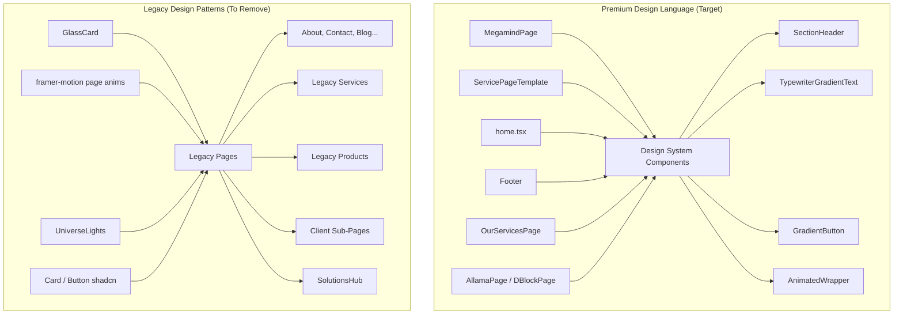
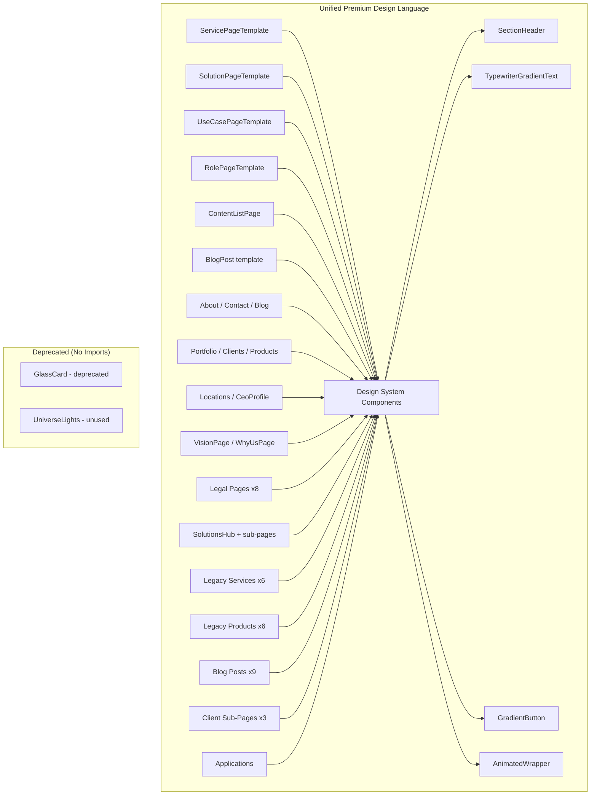

# Design Document: Digitrans Website Premium Design Coherence Overhaul

## Overview

This design document defines the migration strategy for bringing every page and component in the Digitrans website into alignment with the Premium Design Language already established in the Homepage, Footer, MegamindPage, AllamaPage, DBlockPage, ModelsPage, ServicePageTemplate, OurServicesPage, and AnimatedDataViz.

The overhaul is purely visual/CSS — no business logic, data models, or API changes are involved. The work consists of:
1. Replacing legacy components (GlassCard, Card, framer-motion page animations, UniverseLights) with premium equivalents
2. Applying consistent visual patterns (backdrop-blur cards, floating gradient orbs, grid overlays, gradient text)
3. Standardizing on the shared design system components (SectionHeader, TypewriterGradientText, GradientButton, AnimatedWrapper)

The gold standard references are:
- **MegamindPage.tsx** — product page reference
- **ServicePageTemplate.tsx** — template page reference
- **home.tsx** — homepage reference
- **Footer.tsx** — footer reference
- **OurServicesPage.tsx** — services hub reference

## Architecture

### Current State

The codebase has two co-existing visual systems:


```mermaid
graph TD
    subgraph "Premium Design Language (Target)"
        A[MegamindPage] --> DS[Design System Components]
        B[ServicePageTemplate] --> DS
        C[home.tsx] --> DS
        D[Footer] --> DS
        E[OurServicesPage] --> DS
        F[AllamaPage / DBlockPage] --> DS
        DS --> S1[SectionHeader]
        DS --> S2[TypewriterGradientText]
        DS --> S3[GradientButton]
        DS --> S4[AnimatedWrapper]
    end

    subgraph "Legacy Design Patterns (To Remove)"
        L1[GlassCard] --> LP[Legacy Pages]
        L2[framer-motion page anims] --> LP
        L3[UniverseLights] --> LP
        L4[Card / Button shadcn] --> LP
        LP --> P1[About, Contact, Blog...]
        LP --> P2[Legacy Services]
        LP --> P3[Legacy Products]
        LP --> P4[Client Sub-Pages]
        LP --> P5[SolutionsHub]
    end
```

### Target State

All pages converge to a single visual system. Every page uses the same component library, color palette, spacing conventions, and animation patterns.


```mermaid
graph TD
    subgraph "Unified Premium Design Language"
        DS[Design System Components]
        DS --> S1[SectionHeader]
        DS --> S2[TypewriterGradientText]
        DS --> S3[GradientButton]
        DS --> S4[AnimatedWrapper]
        
        T1[ServicePageTemplate] --> DS
        T2[SolutionPageTemplate] --> DS
        T3[UseCasePageTemplate] --> DS
        T4[RolePageTemplate] --> DS
        T5[ContentListPage] --> DS
        T6[BlogPost template] --> DS
        
        SP1[About / Contact / Blog] --> DS
        SP2[Portfolio / Clients / Products] --> DS
        SP3[Locations / CeoProfile] --> DS
        SP4[VisionPage / WhyUsPage] --> DS
        SP5[Legal Pages x8] --> DS
        SP6[SolutionsHub + sub-pages] --> DS
        SP7[Legacy Services x6] --> DS
        SP8[Legacy Products x6] --> DS
        SP9[Blog Posts x9] --> DS
        SP10[Client Sub-Pages x3] --> DS
        SP11[Applications] --> DS
    end
    
    subgraph "Deprecated (No Imports)"
        GC[GlassCard - deprecated]
        UL[UniverseLights - unused]
    end
```

### Migration Strategy

The migration follows a priority order that maximizes visual impact:

1. **Templates first** — SolutionPageTemplate, UseCasePageTemplate, RolePageTemplate, ContentListPage (affects 29 routes via data-driven rendering)
2. **Shared components** — GridBackground, Hero, Navbar alignment, PromoBanner
3. **Standalone pages** — About, Contact, Blog, Portfolio, Clients, Products hub, Locations, CeoProfile, VisionPage, WhyUsPage, SolutionsHub, Applications
4. **Legacy pages** — Legacy services (6), legacy solutions (3), legacy products (6), client sub-pages (3), solutions hub sub-pages (4), blog posts (9)
5. **Legal pages** — Old set (4) + new set (4)
6. **Cleanup** — GlassCard deprecation, framer-motion audit, color palette audit

## Components and Interfaces

### Design System Components (Existing — No Changes)

These components are already built and form the target design system:

#### SectionHeader
```tsx
<SectionHeader
  badge="Optional Badge"           // purple pill badge above title
  title="Section Title"            // gradient text by default
  description="Optional subtitle"  // gray-400 text below
  alignment="center"               // "center" | "left"
  gradientTitle={true}             // gradient or white title
  titleAs="h2"                     // semantic heading level
/>
```

#### TypewriterGradientText
```tsx
<TypewriterGradientText
  text="Hero Heading Text"
  className="text-4xl md:text-5xl lg:text-6xl font-bold"
  delay={0}
  duration={1.5}
  showCursor={true}
/>
```

#### GradientButton
```tsx
<GradientButton
  variant="primary"    // "primary" | "secondary" | "outline" | "ghost" | "link"
  size="lg"            // "sm" | "md" | "lg" | "xl" | "icon"
  leftIcon={<Calendar className="w-5 h-5" />}
  onClick={() => navigate("/contact")}
>
  Book a Consultation
</GradientButton>
```

#### AnimatedWrapper
```tsx
<AnimatedWrapper
  animation="fadeUp"   // "fadeUp" | "fadeDown" | "fadeLeft" | "fadeRight" | "scale" | "blur" | etc.
  delay={0.1}
  duration={0.6}
  once={true}
  amount={0.3}
>
  <div>Content to animate on scroll</div>
</AnimatedWrapper>
```


### Premium Design Language Specification

Every page must implement these exact patterns:

#### Page Shell
```tsx
<div className="min-h-screen bg-black">
  <Navbar />
  <main>
    {/* Hero section */}
    {/* Content sections */}
    {/* CTA section */}
  </main>
  <Footer />
</div>
```

#### Hero Section Pattern
```tsx
<section className="relative pt-36 pb-24 overflow-hidden">
  {/* Animated background */}
  <div className="absolute inset-0">
    <div className="absolute inset-0 bg-gradient-to-b from-purple-950/40 via-black/80 to-black" />
    {/* Floating gradient orbs */}
    <div className="absolute top-0 left-0 w-full h-full">
      <div className="absolute top-20 left-[10%] w-72 h-72 bg-purple-600/15 rounded-full blur-[100px] animate-pulse" />
      <div className="absolute top-40 right-[15%] w-96 h-96 bg-blue-600/10 rounded-full blur-[120px] animate-pulse" style={{ animationDelay: "1.5s" }} />
      <div className="absolute bottom-20 left-[30%] w-80 h-80 bg-indigo-600/10 rounded-full blur-[100px] animate-pulse" style={{ animationDelay: "3s" }} />
    </div>
    {/* Grid pattern overlay */}
    <div className="absolute inset-0 opacity-[0.03]" style={{
      backgroundImage: "linear-gradient(rgba(139,92,246,0.3) 1px, transparent 1px), linear-gradient(90deg, rgba(139,92,246,0.3) 1px, transparent 1px)",
      backgroundSize: "60px 60px",
    }} />
  </div>
  {/* Content */}
  <div className="relative container mx-auto px-4">
    <TypewriterGradientText text="Page Title" className="text-4xl md:text-5xl lg:text-6xl font-bold" />
    <p className="text-xl text-gray-300/90 max-w-3xl">Subtitle text</p>
  </div>
</section>
```

#### Backdrop Blur Card Pattern
```tsx
{/* Standard card */}
<div className="group bg-gray-900/50 backdrop-blur-sm border border-gray-800/50 rounded-2xl p-8 hover:border-purple-500/30 transition-all duration-300">
  {/* Hover gradient overlay */}
  <div className="absolute inset-0 bg-gradient-to-br from-purple-500/5 to-blue-500/5 opacity-0 group-hover:opacity-100 transition-opacity duration-500 rounded-2xl" />
  {/* Icon container */}
  <div className="w-14 h-14 bg-gradient-to-br from-purple-500/20 to-blue-500/20 rounded-xl flex items-center justify-center mb-6">
    <Icon className="w-7 h-7 text-purple-400" />
  </div>
  <h3 className="text-xl font-semibold text-white mb-3 group-hover:text-purple-300 transition-colors">{title}</h3>
  <p className="text-gray-400">{description}</p>
</div>
```

#### Numbered Item Pattern
```tsx
<div className="flex gap-6">
  <span className="text-4xl font-mono text-gray-600">{String(index + 1).padStart(2, '0')}</span>
  <div>
    <h3 className="text-xl font-semibold text-white mb-2">{title}</h3>
    <p className="text-gray-400">{description}</p>
  </div>
</div>
```

#### Content Section Pattern
```tsx
<section className="py-20 relative">
  <div className="container mx-auto px-4">
    <SectionHeader badge="Badge" title="Section Title" description="Description" />
    <div className="grid grid-cols-1 md:grid-cols-2 lg:grid-cols-3 gap-8 mt-16">
      {items.map((item, i) => (
        <AnimatedWrapper key={i} animation="fadeUp" delay={i * 0.1}>
          {/* Backdrop blur card */}
        </AnimatedWrapper>
      ))}
    </div>
  </div>
</section>
```

#### Bottom CTA Section Pattern
```tsx
<section className="py-24 relative overflow-hidden">
  <div className="absolute inset-0">
    <div className="absolute top-1/2 left-1/4 w-96 h-96 bg-purple-600/10 rounded-full blur-[120px]" />
    <div className="absolute top-1/2 right-1/4 w-96 h-96 bg-blue-600/10 rounded-full blur-[120px]" />
  </div>
  <div className="relative container mx-auto px-4 text-center">
    <h2 className="text-3xl md:text-4xl font-bold mb-6">
      <span className="bg-gradient-to-r from-purple-400 via-blue-400 to-indigo-400 bg-clip-text text-transparent">
        Ready to Get Started?
      </span>
    </h2>
    <p className="text-xl text-gray-400 mb-8 max-w-2xl mx-auto">Description</p>
    <GradientButton size="lg" leftIcon={<Calendar className="w-5 h-5" />} onClick={() => navigate("/contact")}>
      Book a Consultation
    </GradientButton>
  </div>
</section>
```

#### Color Palette
| Token | Usage | Value |
|-------|-------|-------|
| Primary accent | Icons, borders, hover states | `purple-400` / `purple-500` |
| Secondary accent | Gradient endpoints, orbs | `blue-400` / `blue-500` |
| Tertiary accent | Gradient endpoints | `indigo-400` |
| Card background | Card fills | `bg-gray-900/50` |
| Card border | Default borders | `border-gray-800/50` |
| Card hover border | Hover state | `hover:border-purple-500/30` |
| Page background | All pages | `bg-black` |
| Primary text | Headings | `text-white` |
| Body text | Descriptions | `text-gray-300/90` or `text-gray-400` |
| Secondary text | Captions, labels | `text-gray-500` |
| Numbered items | Mono numbers | `text-gray-600` |
| Success indicators | Checkmarks | `green-400` / `emerald-500` |
| Gradient text | Section headings | `from-purple-400 via-blue-400 to-indigo-400` |

### Legacy Components to Remove/Replace

| Legacy Component | Replacement |
|-----------------|-------------|
| `GlassCard` | Inline `bg-gray-900/50 backdrop-blur-sm border border-gray-800/50 rounded-2xl` |
| `Card` (shadcn) | Same inline backdrop-blur card pattern |
| `motion.div` (page-level) | `AnimatedWrapper` |
| `UniverseLights` | Remove entirely (floating gradient orbs are per-section) |
| `Button` (shadcn) | `GradientButton` |
| `ProgressBar` | Remove (not part of premium design) |
| `BackToTop` | Remove (not part of premium design) |
| `StickyCTA` | Remove (not part of premium design) |
| `RegistrationModal` | `GradientButton` navigating to `/contact` |
| `Dialog` (for cards) | Direct navigation to target page |

### Import Replacement Map

For each page being migrated, replace these imports:

```tsx
// REMOVE these imports:
import { motion } from "framer-motion";
import { GlassCard } from "@/components/ui/glass-card";
import { Card, CardContent, CardHeader } from "@/components/ui/card";
import { Button } from "@/components/ui/button";
import UniverseLights from "@/components/UniverseLights";
import { ProgressBar } from "@/components/ui/progress-bar";
import { BackToTop } from "@/components/ui/back-to-top";
import { StickyCTA } from "@/components/ui/sticky-cta";
import { Dialog, DialogContent, DialogTrigger } from "@/components/ui/dialog";

// ADD these imports (as needed):
import { GradientButton } from "@/components/ui/gradient-button";
import { SectionHeader } from "@/components/ui/section-header";
import { AnimatedWrapper } from "@/components/ui/animated-wrapper";
import { TypewriterGradientText } from "@/components/ui/typewriter-text";
```


## Data Models

No data model changes are required. This is a purely visual/CSS overhaul. All existing data structures, API calls, route definitions, and content remain unchanged.

The only data-adjacent concern is ensuring that template pages (SolutionPageTemplate, UseCasePageTemplate, RolePageTemplate, ContentListPage) continue to correctly render their data-driven content after the visual migration. The data interfaces (`ServiceData`, `SolutionData`, `UseCaseData`, `RoleData`) are not modified.

## Correctness Properties

*A property is a characteristic or behavior that should hold true across all valid executions of a system — essentially, a formal statement about what the system should do. Properties serve as the bridge between human-readable specifications and machine-verifiable correctness guarantees.*

This feature is a UI/CSS design overhaul with no business logic, data transformations, or algorithmic behavior. All 38 requirements specify visual patterns (CSS classes, component usage, color values, spacing) and component replacement (GlassCard → inline cards, framer-motion → AnimatedWrapper).

None of the acceptance criteria are amenable to property-based testing because:
- They describe visual appearance, not computable input/output relationships
- They specify which CSS classes and components to use, not behavioral invariants
- They require visual inspection or static code analysis (grep), not runtime property verification
- Accessibility criteria (Req 38) require manual testing with assistive technologies

**No correctness properties are defined for this feature.**

Verification will be done through:
1. Visual review of each page after migration
2. Static code analysis (grep for GlassCard imports, framer-motion page-level imports)
3. Manual responsive testing across breakpoints
4. Accessibility audit with browser dev tools

## Error Handling

Since this is a visual redesign with no new logic, error handling concerns are minimal:

1. **Netlify Forms preservation (Req 5.6)**: The Contact page redesign must preserve the `form-name` attribute, honeypot field, and AJAX submission handler. Failure to preserve these would break form submissions silently. Verify by submitting a test form after migration.

2. **Route integrity**: No routes are added or removed. All existing routes in `App.tsx` remain unchanged. The redesign only modifies the visual rendering of page components.

3. **Component import errors**: When removing legacy imports (GlassCard, Card, Button, Dialog), ensure no remaining JSX references those components. TypeScript compilation will catch missing references.

4. **framer-motion exceptions**: The following components are explicitly allowed to retain framer-motion usage:
   - `AnimatedDataViz` — counter animations
   - `Hero` — client logo infinite scroll
   - `TypewriterGradientText` / `TypewriterText` — clip-path reveal animation
   - `GridBackground` — if retained (may be simplified or removed per Req 26)

5. **SEO metadata (Req 36)**: Pages using direct `document.title` manipulation should be migrated to the `SEO` component. Missing metadata won't cause errors but will affect search rankings.

## Testing Strategy

### Approach

This is a visual/CSS migration. Traditional unit tests and property-based tests are not applicable because the requirements specify visual patterns, not behavioral logic. The testing strategy focuses on verification methods appropriate for UI redesign work.

### Visual Verification (Primary)

Each page must be visually reviewed after migration to confirm:
- bg-black background renders correctly
- Floating gradient orbs are visible and positioned correctly
- Grid overlay is subtle (opacity-[0.03]) and not competing with content
- Backdrop-blur cards have correct border, background, and hover effects
- Typography uses correct sizes and colors per the palette
- Responsive layout works at mobile (375px), tablet (768px), and desktop (1280px+)

### Static Code Analysis (Automated)

After all migrations are complete, run these verification checks:

```bash
# Verify no GlassCard imports remain in page components
grep -r "GlassCard" src/components/pages/ --include="*.tsx"
# Expected: 0 results

# Verify no page-level framer-motion imports (excluding allowed exceptions)
grep -r "from \"framer-motion\"" src/components/pages/ --include="*.tsx"
# Expected: 0 results in page files (exceptions are in ui/ and sections/)

# Verify no UniverseLights imports remain
grep -r "UniverseLights" src/components/ --include="*.tsx"
# Expected: 0 results

# Verify no Card imports from shadcn in page components
grep -r "from.*ui/card" src/components/pages/ --include="*.tsx"
# Expected: 0 results

# Verify all pages import AnimatedWrapper (spot check)
grep -r "AnimatedWrapper" src/components/pages/ --include="*.tsx" | wc -l
# Expected: high count across all page files
```

### Functional Smoke Tests

After migration, manually verify these critical paths:
1. **Contact form submission** — Netlify Forms still works (Req 5.6)
2. **Navigation** — All routes render without errors
3. **Hero video** — Homepage video background still plays (Req 27.6)
4. **Client logo scroll** — Homepage logo carousel still animates (Req 27.6)
5. **Blog post rendering** — Dynamic blog posts render correctly
6. **Template data rendering** — All 10 industry pages, 9 use case pages, 5 role pages render their data correctly

### Accessibility Verification

Use browser dev tools and Lighthouse to verify:
- Color contrast ratios meet WCAG 2.1 AA (4.5:1 normal text, 3:1 large text)
- Keyboard focus indicators are visible against dark backgrounds
- Semantic HTML structure is maintained (header, main, section, nav, footer)
- Images and icons have alt text or aria-labels

### No Property-Based Tests

This feature has no correctness properties and therefore no property-based tests. All requirements are visual/CSS specifications that cannot be meaningfully validated through automated property-based testing. The testing strategy relies on visual review, static code analysis, and functional smoke tests as described above.

## File-by-File Migration Plan

### Priority 1: Templates (High Impact — affects 29+ routes)

| File | Routes Affected | Key Changes |
|------|----------------|-------------|
| `src/components/pages/solutions/SolutionPageTemplate.tsx` | 10 industry pages | Replace GlassCard → backdrop-blur cards, add orbs/grid, use design system components |
| `src/components/pages/use-cases/UseCasePageTemplate.tsx` | 9 use case pages | Verify/align with premium patterns, replace any remaining legacy patterns |
| `src/components/pages/roles/RolePageTemplate.tsx` | 5 role pages | Verify/align with premium patterns, ensure CheckCircle green gradient |
| `src/components/pages/university/ContentListPage.tsx` | 4 university pages | Replace legacy patterns with premium design |
| `src/components/pages/BlogPost.tsx` | 9+ blog routes | Redesign article layout with backdrop-blur content area |

### Priority 2: Shared Components

| File | Impact | Key Changes |
|------|--------|-------------|
| `src/components/GridBackground.tsx` | All pages | Remove falling lines, remove dot pattern, simplify to minimal bg-black or remove entirely |
| `src/components/Hero.tsx` | Homepage | Replace framer-motion → AnimatedWrapper, remove UniverseLights, replace Card → backdrop-blur cards, remove Dialog |

### Priority 3: Standalone Pages

| File | Key Changes |
|------|-------------|
| `src/components/pages/About.tsx` or `src/components/About.tsx` | Full premium redesign |
| `src/components/pages/Contact.tsx` | Premium redesign, preserve Netlify Forms |
| `src/components/pages/Blog.tsx` | Premium redesign for listing page |
| `src/components/pages/Portfolio.tsx` | Premium redesign |
| `src/components/pages/Clients.tsx` | Premium redesign |
| `src/components/pages/Products.tsx` | Premium redesign |
| `src/components/pages/Locations.tsx` | Premium redesign, remove RegistrationModal |
| `src/components/pages/CeoProfile.tsx` | Premium redesign, remove Dialog |
| `src/components/pages/VisionPage.tsx` | Verify/align premium patterns |
| `src/components/pages/WhyUsPage.tsx` | Verify/align premium patterns |
| `src/components/pages/university/UniversityHubPage.tsx` | Verify/align premium patterns |
| `src/components/pages/SolutionsHub.tsx` | Premium redesign |
| `src/components/pages/Applications.tsx` | Premium redesign |

### Priority 4: Legacy Pages

| Category | Files | Key Changes |
|----------|-------|-------------|
| Legacy Services (6) | `MvpDevelopment.tsx`, `ProductStrategy.tsx`, `FullStackDevelopment.tsx`, `DevOpsScaling.tsx`, `AIConsultancy.tsx`, `AIAccounting.tsx` | Full premium redesign each |
| Legacy Solutions (3) | `TechnicalCofounder.tsx`, `SaaSConsulting.tsx`, `LegacyModernization.tsx` | Full premium redesign each |
| Legacy Products (6) | `Ledger.tsx`, `uTrack.tsx`, `Ember.tsx`, `GoDash.tsx`, `BigBytes.tsx`, `KozmoAI.tsx` | Full premium redesign each |
| Client Sub-Pages (3) | `Fortune500.tsx`, `GovAgencies.tsx`, `TechStartups.tsx` | Full premium redesign each |
| Solutions Hub Sub-Pages (4) | `IoTAccelerator.tsx`, `AIAssistant.tsx`, `ContainerOptimizer.tsx`, `DevOpsAccelerator.tsx` | Full premium redesign each |
| Blog Posts (9) | `EnablingClientMaximizeIT.tsx`, `BuildingEnterpriseDataLakes.tsx`, `MLOpsBestPractices.tsx`, `CloudNativeArchitecturePatterns.tsx`, `RealTimeAnalyticsKafka.tsx`, `DigitalTransformationBanking.tsx`, `CloudMigrationHealthcare.tsx`, `AIRetailPersonalization.tsx`, `MultiAgentOrchestration.tsx` | Premium redesign each |

### Priority 5: Legal Pages

| Category | Files | Key Changes |
|----------|-------|-------------|
| Old Legal (4) | `Privacy.tsx`, `Terms.tsx`, `Cookies.tsx`, `Security.tsx` | Replace framer-motion → AnimatedWrapper, align hero pattern |
| New Legal (4) | `DataRetention.tsx`, `DataProtectionAddendum.tsx`, `CodeOfConduct.tsx`, `ModernSlavery.tsx` | Replace framer-motion → AnimatedWrapper |

### Priority 6: Cleanup & Audit

| Task | Description |
|------|-------------|
| GlassCard deprecation | Add deprecation comment to `src/components/ui/glass-card.tsx`, verify zero page-level imports |
| framer-motion audit | Verify only allowed exceptions retain framer-motion imports |
| Color palette audit | Grep for off-palette colors (pink-400, yellow-400) in primary UI elements |
| SEO component migration | Replace direct `document.title` usage with `SEO` component |
| Responsive spot-check | Test all migrated pages at 375px, 768px, 1280px |
